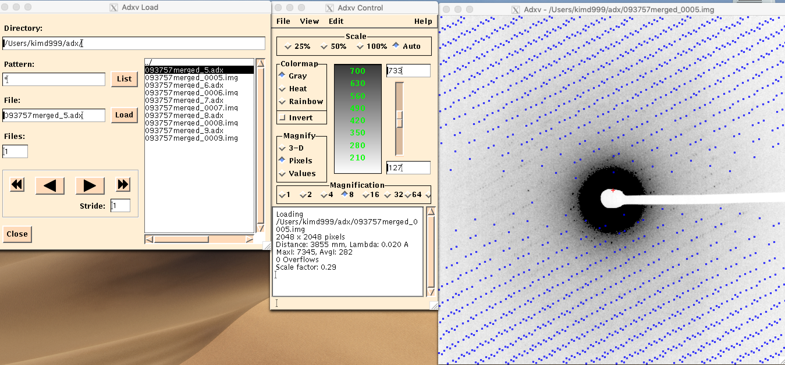

## Fiji
   - Function: inspect movies (*.mrc) quality manually
## mrc2smv 
   - Function: convert .mrc file to SMV imgage file (.img)
      - because data reduction software developed for x-ray crystallography does not understand MRC or TVIPS files
   - tvips-tools-jiffies has mrc2smv
## Adxv
   - Open method: (in macOS) double-click Adxv in /Applications
   - Function 1: triage image quality manually
      - Input: *.img, *.mrc, *.mrcs file
      - Output example
         - 
   - Function 2: locate ORGX and ORGY manually (however, AutoMicroED will estimate ORGX and ORGY automatically if user specified an argument for this function and eman2 is installed)
      - Input: AutoMicroED prepares by eman2
      - Output example
         - 
## xds
   - Function
      - index and integrate SMV image files
      - process single-crystal monochromatic diffraction data recorded by the rotation method
   - Input
      - SMV image files
   - Output
   	 - [XDS_ASCII.HKL that contains corrected intensities of all reflections recorded in the data images.](https://xds.mr.mpg.de/html_doc/xds_files.html#XDS_ASCII.HKL)
   	 - CORRECT.LP that has COMPLETENESS information.
   - Automatic troubleshootings will be tried depending on situations
       - These troubleshootings include
         - sliding SPOT RANGE, applying half SPOT RANGE and full BACKGROUND RANGE, running shorter JOBs, applying shorter DATA RANGE and trying DELPHI=10
       - Additionally, once CORRECT.LP is found, AutoMicroED further iterates xds looping various BEAM DIVERGENCE and REFLECTING RANGE values until ISa no longer improves.
## spot2pdb
   - Main function: To provide final output for publication purpose (showing what range/wedge of data was collected).
   - Other function: spot2pdb can visualize which spots were indexed and not indexed by XDS as well. However, AutoMicroED recommends to use generate_adx for this purpose.
   - Input (per mrcs)
      - SPOT.XDS
         - [contains a list of strong observed diffraction spots that is generated by the "COLSPOT" step](https://xds.mr.mpg.de/html_doc/xds_files.html#SPOT.XDS)
      - XPARM.XDS
         - generated by IDXREF
         - ["contains all diffraction parameters necessary for computing the locations of all reflections occurring in the data images."](https://xds.mr.mpg.de/html_doc/xds_files.html)
   - Output (per mrcs)
      - SPOT-indexed.pdb, SPOT-notindexed.pdb
   - A user needs to inspect manually.
      - To do
         - Copy merged SPOT.pdb files to user's computer.
            - For example, scp -r kimd999@kriosgpu.emsl.pnl.gov:/gpustorage/DN/microED/acet/protein_False/output/20210726_18_50_22/spot2pdb_result_merged .
         - Open with coot
            - [For example, coot SPOT-*.pdb](https://strucbio.biologie.uni-konstanz.de/xdswiki/index.php/Spot2pdb)
            - Visualiazation example in coot
               - 
## generate_adx
   - Function: whole frame verification (checking index)
   - This is optional, but recommended.
   - A user needs to inspect manually.
   - Input: XDS_ASCII.HKL in xds folder per each input mrc(s)
   - Output: adx files in img folder per each input mrc(s)
      - Example
         - 
   - To do 
      - Install (once)
         - [copy generate_adx_source_file to user's folder](https://strucbio.biologie.uni-konstanz.de/xdswiki/index.php/Generate_adx)
         - gfortran -O -C generate_adx.f90 -o generate_adx
      - Specify generate_adx folder that has compiled generate_adx binary
         - Refer (AutoMicroED git repository)/templates/args_file/explanation_of_args.txt
      - Analysis method
         - (in macOS) double-click Adxv in /Applications
         - Open both input img (or mrcs) and adx file
            - (If generated adx files lacks extension, then put .adx extension)
               - (Welcome to re-use/modify (AutoMicroED git repository)/util/add_extension.py)
## xds-viewer
   - Function: allows only per frame verification (checking index)
   - This is optional, but recommended.
   - A user needs to inspect manually.
   - To do
      - Install (once)
         - macOS
            - Download xds-viewer binary package from http://xds-viewer.sourceforge.net
            - Move XDS-Viewer binary to /Applications and double-click there
         - Linux
            - Download https://strucbio.biologie.uni-konstanz.de/pub/linux_bin/XDS-viewer
               - (for example,) wget https://strucbio.biologie.uni-konstanz.de/pub/linux_bin/XDS-viewer
            - chmod +rwx XDS-viewer
         - windowsOS
            - We found no evidence of WindowsOS support
      - Input
         - Download FRAME.cbf (Crystallographic Binary File) to user's computer
            - For example, scp kimd999@kriosgpu.emsl.pnl.gov:/gpustorage/DN/microED/acet/protein_False/output/20210625_19_39_22/131749merged/xds/FRAME.cbf .
         - (for mac), double-click xds-viewer binary in /Applications, then File -> Load Image (FRAME.cbf)
         - (for Linux), we couldn't run XDS-viewer even after logging in -X, -XC, -Y with 
            - "However,qt.qpa.screen: QXcbConnection: Could not connect to display
Could not connect to any X display."
      - Output example
         - 
## xscale (1st run)
   - Function: scale .mrc files
      - Retrieve LATT, SYMM records
   - Input: XDS_ASCII.HKL
   - Output: output.ahkl
## xscale (2nd run)
   - Function: merge (many) XDS_ASCII.HKL files
   - Input: Many XDS_ASCII.HKL files from same SPACE_GROUP_NUMBER and similar UNIT_CELL_CONSTANTS
      - (If absolute difference of a, b, c, alpha, beta, gamma of UNIT_CELL < 1 between datasets, it is considered as "similar" enough to be merged).
   - Output: XDS_ASCII_merged.hkl
## xdsconv
   - Function: convert reflection data files from xds or xscale into various formats for crystal structure determination like CCP4, or SHELX
   - Input: XDS_ASCII_merged.hkl
   - Output (small molecule): shelxt_input_from_xdsconv.hkl SHELX !CCP4_I+F ! or CCP4_I or CCP4_F or SHELX or CNS
   - Output (protein): ready_for_f2mtz.hkl CCP4_I+F
## (for small molecule)
   - [link](./reference/analyze_small_molecule_result.md)
## (for protein)
   - [link](./reference/analyze_protein_result.md)
